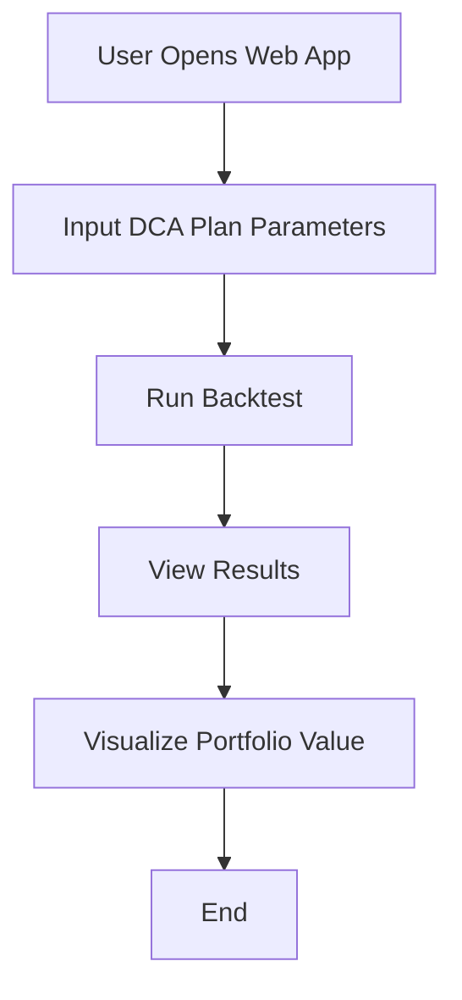

# DCA Backtester & Live Execution

A powerful Dollar-Cost Averaging (DCA) backtesting tool with **live execution capabilities** on Base Sepolia testnet via CDP AgentKit integration.

## Features

### 📊 Backtesting
- Real-time price data from CryptoCompare
- Sophisticated DCA strategies with dip buying
- Advanced selling strategies (profit taking, rebalancing, stop loss)
- Detailed performance metrics and visualizations
- APY calculations and strategy analysis
- Trade history tracking

### 🔴 Live Execution (NEW)
- **CDP AgentKit integration** for live DCA execution
- **Base Sepolia testnet** support
- **Real-time network status** and gas price monitoring
- **24-hour spend tracking** with configurable limits
- **Gas fee protection** (max percentage of transaction value)
- **Wallet connection** verification and balance checking

## Setup

### 1. Clone the repository:
```bash
git clone https://github.com/rafasantama/dca-backtester.git
cd dca-backtester
```

### 2. Install dependencies:
```bash
# Install base dependencies
pip install -r requirements.txt

# For live execution, install CDP SDK
pip install cdp-sdk web3 eth-account
```

### 3. Configure environment:
```bash
# Copy environment template
cp .env.example .env

# Edit .env file with your API keys:
# - CRYPTOCOMPARE_API_KEY (for backtesting)
# - CDP_API_KEY_ID and CDP_PRIVATE_KEY (for live execution)
```

### 4. Run the Streamlit app:
```bash
python -m streamlit run dca_backtester/web_app.py
```

## Usage

### 📊 Backtesting Mode
1. **Navigate to "Backtesting" tab**
2. **Configure your DCA strategy:**
   - Set investment amount and frequency
   - Enable/disable dip buying
   - Configure selling strategy
   - Set date range for backtesting

3. **Run the backtest and analyze results:**
   - View portfolio performance chart
   - Check performance metrics (ROI, APY, Sharpe Ratio)
   - Analyze trade history
   - Get AI-powered strategy analysis

### 🔴 Live Execution Mode
1. **Navigate to "Live Execution" tab**
2. **Check network status** (Base Sepolia connectivity)
3. **Connect your wallet:**
   - Enter your Base Sepolia wallet address
   - Verify connection and network
4. **Configure DCA plan:**
   - Set target asset (ETH, BTC, etc.)
   - Configure investment amount and frequency
   - Set risk management limits
5. **Execute DCA:**
   - Review risk dashboard
   - Execute manual DCA purchases
   - Monitor transaction history

## 🚀 Getting Started with Live Execution

### Prerequisites
- **Base Sepolia testnet** wallet with test ETH
- **CDP API keys** from [Coinbase Developer Platform](https://portal.cdp.coinbase.com/)
- **Test USDC** for DCA funding

### Quick Start
1. Get Base Sepolia testnet ETH from [Base Faucet](https://www.coinbase.com/faucets/base-ethereum-sepolia-faucet)
2. Obtain CDP API keys from Coinbase Developer Platform
3. Configure `.env` file with your credentials
4. Launch the app and navigate to "Live Execution" tab

## Live Demo

Visit the live demo at: [Your Streamlit App URL]

## License

MIT License

## Detailed Documentation

### Overview
The DCA Backtester is a tool designed to simulate and evaluate Dollar-Cost Averaging (DCA) investment strategies. It allows users to define a DCA plan, run backtests against historical data, and visualize the results.

### Modules and Components

#### 1. `models.py`
- **DCAPlan**: Defines the parameters of a DCA strategy, including:
  - `initial_investment`: The starting investment amount.
  - `monthly_contribution`: The amount invested each month.
  - `frequency`: The frequency of investments (e.g., monthly, weekly).
  - `start_date`: The date to begin the DCA strategy.
  - `end_date`: The date to end the DCA strategy.
- **Frequency**: An enumeration of possible investment frequencies (e.g., `MONTHLY`, `WEEKLY`).

#### 2. `backtester.py`
- **Backtester**: The core engine that simulates the DCA strategy using historical data.
  - It calculates the number of shares purchased at each investment interval based on the current price.
  - It tracks the total investment, total shares, and portfolio value over time.

#### 3. `web_app.py`
- **Streamlit Web Application**: Provides a user-friendly interface to:
  - Input DCA plan parameters.
  - Run backtests.
  - Visualize results using interactive charts.

### Practical Examples

#### Example 1: Defining a DCA Plan
```python
from dca_backtester.models import DCAPlan, Frequency

plan = DCAPlan(
    initial_investment=1000,
    monthly_contribution=100,
    frequency=Frequency.MONTHLY,
    start_date="2020-01-01",
    end_date="2023-01-01"
)
```

#### Example 2: Running a Backtest
```python
from dca_backtester.backtester import Backtester

backtester = Backtester(plan)
results = backtester.run()
print(results)
```

#### Example 3: Visualizing Results
```python
import streamlit as st
import plotly.graph_objects as go

st.title("DCA Backtest Results")
fig = go.Figure(data=[go.Scatter(x=results.index, y=results['portfolio_value'], mode='lines', name='Portfolio Value')])
st.plotly_chart(fig)
```

### User Experience Flow
Below is a mermaid flow graph illustrating the user experience steps:



### Conclusion
The DCA Backtester is a powerful tool for evaluating investment strategies. By following the examples and understanding the modules, users can effectively simulate and analyze their DCA plans. 
