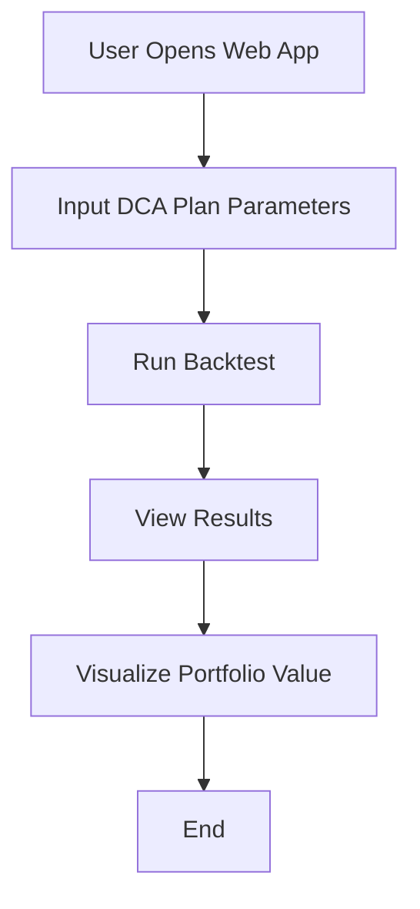

# DCA Backtester

A powerful Dollar-Cost Averaging (DCA) backtesting tool that helps you analyze and optimize your cryptocurrency investment strategies.

## Features

- Real-time price data from CryptoCompare
- Sophisticated DCA strategies with dip buying
- Advanced selling strategies (profit taking, rebalancing, stop loss)
- Detailed performance metrics and visualizations
- APY calculations and strategy analysis
- Trade history tracking

## Setup

1. Clone the repository:
```bash
git clone https://github.com/yourusername/dca-backtester.git
cd dca-backtester
```

2. Install dependencies:
```bash
pip install -r requirements.txt
```

3. Run the Streamlit app:
```bash
python -m streamlit run dca_backtester/web_app.py
```

## Usage

1. Configure your DCA strategy:
   - Set investment amount and frequency
   - Enable/disable dip buying
   - Configure selling strategy
   - Set date range for backtesting

2. Run the backtest and analyze results:
   - View portfolio performance chart
   - Check performance metrics (ROI, APY, Sharpe Ratio)
   - Analyze trade history
   - Compare strategy performance

## Live Demo

Visit the live demo at: [Your Streamlit App URL]

## License

MIT License

## Detailed Documentation

### Overview
The DCA Backtester is a tool designed to simulate and evaluate Dollar-Cost Averaging (DCA) investment strategies. It allows users to define a DCA plan, run backtests against historical data, and visualize the results.

### Modules and Components

#### 1. `models.py`
- **DCAPlan**: Defines the parameters of a DCA strategy, including:
  - `initial_investment`: The starting investment amount.
  - `monthly_contribution`: The amount invested each month.
  - `frequency`: The frequency of investments (e.g., monthly, weekly).
  - `start_date`: The date to begin the DCA strategy.
  - `end_date`: The date to end the DCA strategy.
- **Frequency**: An enumeration of possible investment frequencies (e.g., `MONTHLY`, `WEEKLY`).

#### 2. `backtester.py`
- **Backtester**: The core engine that simulates the DCA strategy using historical data.
  - It calculates the number of shares purchased at each investment interval based on the current price.
  - It tracks the total investment, total shares, and portfolio value over time.

#### 3. `web_app.py`
- **Streamlit Web Application**: Provides a user-friendly interface to:
  - Input DCA plan parameters.
  - Run backtests.
  - Visualize results using interactive charts.

### Practical Examples

#### Example 1: Defining a DCA Plan
```python
from dca_backtester.models import DCAPlan, Frequency

plan = DCAPlan(
    initial_investment=1000,
    monthly_contribution=100,
    frequency=Frequency.MONTHLY,
    start_date="2020-01-01",
    end_date="2023-01-01"
)
```

#### Example 2: Running a Backtest
```python
from dca_backtester.backtester import Backtester

backtester = Backtester(plan)
results = backtester.run()
print(results)
```

#### Example 3: Visualizing Results
```python
import streamlit as st
import plotly.graph_objects as go

st.title("DCA Backtest Results")
fig = go.Figure(data=[go.Scatter(x=results.index, y=results['portfolio_value'], mode='lines', name='Portfolio Value')])
st.plotly_chart(fig)
```

### User Experience Flow
Below is a mermaid flow graph illustrating the user experience steps:



### Conclusion
The DCA Backtester is a powerful tool for evaluating investment strategies. By following the examples and understanding the modules, users can effectively simulate and analyze their DCA plans. 
