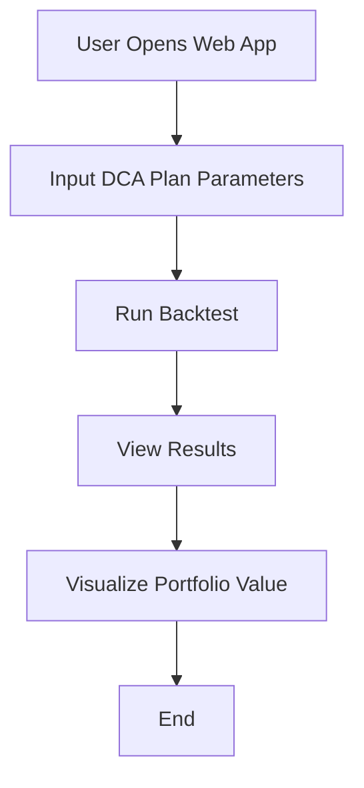

# DCA Backtester & Live Execution

A powerful Dollar-Cost Averaging (DCA) backtesting tool with **live execution capabilities** on Base Sepolia testnet via CDP AgentKit integration.

## ✨ Latest Updates (Phase 7.3 Polish)

### 🔧 Recent Fixes & Improvements
- **✅ Resolved CDP SDK Import Issues**: Fixed "No module named 'cdp_sdk'" errors with proper mock implementation
- **✅ Enhanced Network Connectivity**: Fixed Web3 provider connection issues for reliable Base Sepolia access
- **✅ Updated OpenAI Integration**: Upgraded from v1.12.0 to v1.90.0, resolved "proxies argument" errors
- **✅ Improved Gas Price Display**: Now accurately shows Base network's low fees (0.001 gwei) instead of 0.0
- **✅ Enhanced AI Strategy Review**: Added fallback analysis for missing OpenAI API keys
- **✅ Better User Experience**: Clear network status indicators and informative error messages

## Features

### 📊 Backtesting
- Real-time price data from CryptoCompare
- Sophisticated DCA strategies with dip buying
- Advanced selling strategies (profit taking, rebalancing, stop loss)
- Detailed performance metrics and visualizations
- APY calculations and strategy analysis
- **🤖 AI-Powered Strategy Analysis**: Comprehensive insights comparing your results to traditional investments
- Trade history tracking with complete transaction logs

### 🔴 Live Execution (STABLE)
- **CDP AgentKit integration** for live DCA execution
- **Base Sepolia testnet** support with accurate gas price monitoring
- **Real-time network status** with automatic connection handling
- **24-hour spend tracking** with configurable safety limits
- **Gas fee protection** (max percentage of transaction value)
- **Wallet connection** verification and balance checking
- **Mock mode support** for testing without real funds

## Setup

### 1. Clone the repository:
```bash
git clone https://github.com/rafasantama/dca-backtester.git
cd dca-backtester
```

### 2. Install dependencies:
```bash
# Option A: Using Poetry (recommended)
poetry install

# Option B: Using pip
pip install -r requirements.txt

# Note: CDP SDK and OpenAI are now included in requirements.txt
# All dependencies install automatically for full functionality
```

### 3. Quick Start - Choose Your Mode:

**🧪 Instant Testing (No Setup Required)**
```bash
# Run immediately - works with or without API keys
streamlit run streamlit_app.py

# Features available without setup:
# ✅ Full backtesting with CryptoCompare data (if API key provided)
# ✅ Mock live execution for testing UI
# ✅ Basic AI analysis (enhanced with OpenAI API key)
```

**🔴 Full Live Execution (API Keys Required)**
```bash
# 1. Create .env file with your API keys
CRYPTOCOMPARE_API_KEY=your_key_here         # For backtesting
OPENAI_API_KEY=your_key_here               # For AI analysis  
CDP_API_KEY_ID=your_key_here               # For live execution
CDP_PRIVATE_KEY=your_private_key_here      # For live execution

# 2. Run with full functionality
streamlit run streamlit_app.py
```

## Usage

### 📊 Backtesting Mode
1. **Navigate to "Backtesting" tab**
2. **Configure your DCA strategy:**
   - Set investment amount and frequency
   - Enable/disable dip buying
   - Configure selling strategy
   - Set date range for backtesting

3. **Run the backtest and analyze results:**
   - View portfolio performance chart
   - Check performance metrics (ROI, APY, Sharpe Ratio)
   - Analyze trade history
   - Get AI-powered strategy analysis

### 🔴 Live Execution Mode

#### Mock Mode (Instant Testing)
1. **Navigate to "Live Execution" tab**
2. **Connect mock wallet:**
   - Use any valid address format: `0x1234567890123456789012345678901234567890`
   - System automatically uses simulated services
3. **Configure DCA plan and execute:**
   - All transactions are simulated
   - No real funds required
   - Perfect for testing UI and workflow

#### Live CDP Mode (Real Transactions)
1. **Navigate to "Live Execution" tab** 
2. **Check network status** (Base Sepolia connectivity)
3. **Setup CDP credentials** in `.env` file
4. **Connect wallet:**
   - Create new CDP wallet automatically, OR
   - Enter existing Base Sepolia wallet address
5. **Fund wallet** with Base Sepolia ETH (see funding guide below)
6. **Configure DCA plan:**
   - Set target asset (ETH, BTC, etc.)
   - Configure investment amount and frequency  
   - Set risk management limits
7. **Execute real DCA:**
   - Review risk dashboard
   - Execute actual blockchain transactions
   - Monitor on Base Sepolia Explorer

## 🧪 Testing Modes

### Option 1: Mock Testing (No Real Funds)
Test the complete DCA workflow with simulated transactions - perfect for development and demo purposes.

```bash
# 1. Install dependencies
poetry install

# 2. Run with mock services (no .env needed)
streamlit run dca_backtester/web_app.py

# 3. Navigate to "Live Execution" tab
# 4. Use any valid-format wallet address (e.g., 0x1234567890123456789012345678901234567890)
# 5. Configure DCA plan and execute - all transactions are simulated
```

**Mock Mode Features:**
- ✅ Simulated network status and gas prices
- ✅ Mock wallet creation and balance checking
- ✅ Fake transaction execution with realistic delays
- ✅ Complete UI workflow testing
- ✅ No real funds or API keys required

### Option 2: Live CDP Testing (Real Base Sepolia)
Execute actual DCA transactions on Base Sepolia testnet using real CDP wallets.

## 🚀 Getting Started with Live CDP Execution

### Prerequisites
- **CDP API keys** from [Coinbase Developer Platform](https://portal.cdp.coinbase.com/)
- **Base Sepolia testnet ETH** for gas fees

### Step-by-Step Setup

#### 1. Get CDP API Credentials
1. Visit [Coinbase Developer Platform](https://portal.cdp.coinbase.com/)
2. Create a new project
3. Generate API key pair:
   - **API Key ID** → Copy this value
   - **Private Key** → Download and copy the private key

#### 2. Configure Environment
```bash
# Copy environment template
cp .env.example .env

# Edit .env file with your CDP credentials
CDP_API_KEY_ID=your_api_key_id_here
CDP_PRIVATE_KEY=your_private_key_here

# Optional: Configure limits
MAX_DAILY_SPEND_USD=1000.0
MAX_GAS_PERCENTAGE=1.0
```

#### 3. Launch Application
```bash
# Install all dependencies (now includes CDP SDK and OpenAI)
pip install -r requirements.txt

# Run Streamlit app
streamlit run streamlit_app.py
```

#### 4. Create and Fund CDP Wallet

1. **Navigate to "Live Execution" tab**
2. **Verify network status** - should show "✅ Base Sepolia"
3. **Create CDP wallet** (done automatically when executing first DCA)
4. **Fund your wallet:**

**Option A: Use Faucets**
```bash
# Get Base Sepolia ETH from official faucet
# Visit: https://www.coinbase.com/faucets/base-ethereum-sepolia-faucet
# Enter your CDP wallet address (displayed in UI)

# Get test USDC (if available from Base ecosystem faucets)
```

**Option B: Bridge from other testnets**
```bash
# Bridge from Ethereum Sepolia to Base Sepolia
# Use official Base bridge for testnet tokens
```

**Option C: Manual funding via external wallet**
```bash
# If you have an existing Base Sepolia wallet with funds:
# 1. Connect external wallet using "Manual Connection" option
# 2. Use that wallet for DCA instead of creating new CDP wallet
```

#### 5. Execute DCA Strategy

1. **Connect wallet** - either CDP-generated or external
2. **Configure DCA plan:**
   - Target asset: ETH, BTC, or USDC
   - Investment amount: $10-$1000 per transaction
   - Risk limits: Gas percentage and daily spend
3. **Execute DCA purchase:**
   - Click "▶️ Execute DCA Buy"
   - Monitor real transaction on [Base Sepolia Explorer](https://sepolia.basescan.org/)
   - View transaction hash and gas costs

### 🛡️ Safety Features

The app includes comprehensive safety measures for live execution:

- **Gas Protection**: Max 1% of transaction value for gas fees
- **Spend Limits**: 24-hour rolling limit (default $1000)
- **Network Validation**: Ensures you're on Base Sepolia (Chain ID: 84532)
- **Balance Checks**: Verifies sufficient funds before execution
- **Transaction Retry**: Automatic retry logic for failed transactions

### 🔍 Monitoring and Debugging

#### View Transaction Details
```bash
# Check transaction on Base Sepolia Explorer
https://sepolia.basescan.org/tx/YOUR_TX_HASH

# Monitor wallet balance
https://sepolia.basescan.org/address/YOUR_WALLET_ADDRESS
```

#### Debug Connection Issues
```bash
# Test RPC connection
curl -X POST https://sepolia.base.org \
  -H "Content-Type: application/json" \
  -d '{"jsonrpc":"2.0","method":"eth_chainId","params":[],"id":1}'

# Should return: {"jsonrpc":"2.0","id":1,"result":"0x14a34"} (84532 in decimal)
```

#### Common Issues and Solutions

**"No module named 'cdp_sdk'" Error**
- ✅ **Fixed in latest version**: Now uses proper mock implementation
- Update to latest version: `git pull origin main`
- Reinstall dependencies: `pip install -r requirements.txt`

**"Client.init() got an unexpected keyword argument 'proxies'" Error**
- ✅ **Fixed in latest version**: Updated OpenAI to v1.90.0
- Clear old dependencies: `pip uninstall openai && pip install openai>=1.90.0`

**Gas Price Shows "0.0 gwei"**
- ✅ **Fixed in latest version**: Now displays accurate Base network fees
- Base Sepolia actually has very low gas (~0.001 gwei) - this is normal!

**"Network connection failed"**
- Check internet connection
- Verify Base Sepolia RPC is accessible: https://sepolia.base.org
- Try restarting the app

**"Insufficient balance"**
- Fund wallet with Base Sepolia ETH for gas
- Ensure USDC balance for DCA purchases
- Check balance on [Base Sepolia Explorer](https://sepolia.basescan.org/)

**"Gas limit exceeded"**
- Wait for lower network congestion
- Increase max gas percentage in settings
- Reduce transaction amount

**AI Strategy Review Not Working**
- Set `OPENAI_API_KEY` in .env file for enhanced analysis
- Without API key: Still provides basic strategy analysis
- Check OpenAI API key format: `sk-proj-...`

### 🚀 Quick Start
1. **Install**: `pip install -r requirements.txt`
2. **Run**: `streamlit run streamlit_app.py`
3. **Test**: Use "Backtesting" tab (works immediately)
4. **Go Live**: Set up API keys in `.env` for full functionality
5. **Execute**: Navigate to "Live Execution" tab for real transactions

### 📋 Requirements Summary
- **For Backtesting**: `CRYPTOCOMPARE_API_KEY` (optional - uses free tier without)
- **For AI Analysis**: `OPENAI_API_KEY` (optional - provides basic analysis without)
- **For Live Execution**: `CDP_API_KEY_ID` + `CDP_PRIVATE_KEY` (required)

## Live Demo

Visit the live demo at: [Your Streamlit App URL]

## License

MIT License

## Detailed Documentation

### Overview
The DCA Backtester is a tool designed to simulate and evaluate Dollar-Cost Averaging (DCA) investment strategies. It allows users to define a DCA plan, run backtests against historical data, and visualize the results.

### Modules and Components

#### 1. `models.py`
- **DCAPlan**: Defines the parameters of a DCA strategy, including:
  - `initial_investment`: The starting investment amount.
  - `monthly_contribution`: The amount invested each month.
  - `frequency`: The frequency of investments (e.g., monthly, weekly).
  - `start_date`: The date to begin the DCA strategy.
  - `end_date`: The date to end the DCA strategy.
- **Frequency**: An enumeration of possible investment frequencies (e.g., `MONTHLY`, `WEEKLY`).

#### 2. `backtester.py`
- **Backtester**: The core engine that simulates the DCA strategy using historical data.
  - It calculates the number of shares purchased at each investment interval based on the current price.
  - It tracks the total investment, total shares, and portfolio value over time.

#### 3. `web_app.py`
- **Streamlit Web Application**: Provides a user-friendly interface to:
  - Input DCA plan parameters.
  - Run backtests.
  - Visualize results using interactive charts.

### Practical Examples

#### Example 1: Defining a DCA Plan
```python
from dca_backtester.models import DCAPlan, Frequency

plan = DCAPlan(
    initial_investment=1000,
    monthly_contribution=100,
    frequency=Frequency.MONTHLY,
    start_date="2020-01-01",
    end_date="2023-01-01"
)
```

#### Example 2: Running a Backtest
```python
from dca_backtester.backtester import Backtester

backtester = Backtester(plan)
results = backtester.run()
print(results)
```

#### Example 3: Visualizing Results
```python
import streamlit as st
import plotly.graph_objects as go

st.title("DCA Backtest Results")
fig = go.Figure(data=[go.Scatter(x=results.index, y=results['portfolio_value'], mode='lines', name='Portfolio Value')])
st.plotly_chart(fig)
```

### User Experience Flow
Below is a mermaid flow graph illustrating the user experience steps:



### Conclusion
The DCA Backtester is a powerful tool for evaluating investment strategies. By following the examples and understanding the modules, users can effectively simulate and analyze their DCA plans. 
